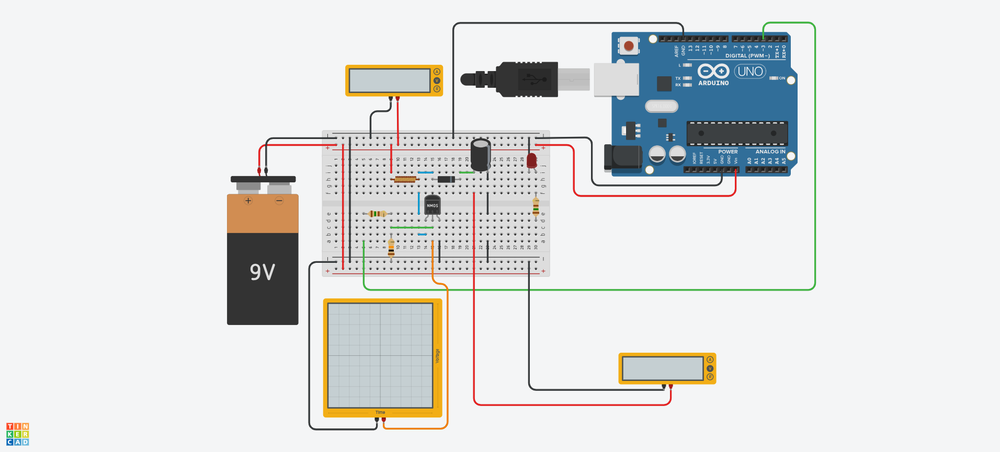

# ⚡ DC-DC Boost Converter (9V to 12V) – Arduino Controlled

## 📖 Introduction

This project demonstrates a simple DC-DC boost converter built using discrete components and controlled via an Arduino Uno. The converter steps up a 9V DC input (from a standard battery) to a regulated 12V output. This type of converter is useful in applications where a higher voltage is needed from a lower-voltage power source, such as powering 12V sensors, actuators, or small DC motors from a 9V battery.

## ⚙️ Working Principle

The boost converter works based on energy storage in an inductor and timed switching via a MOSFET. Here's a simplified breakdown of how it functions:

1. **Switch ON phase**:
   - The N-channel MOSFET, controlled by a PWM signal from the Arduino, turns ON.
   - Current flows through the inductor, storing energy in its magnetic field.
   - During this phase, the diode blocks current from flowing to the output.

2. **Switch OFF phase**:
   - The MOSFET turns OFF.
   - The inductor resists the sudden drop in current and releases its stored energy.
   - The released energy, along with the source voltage, is forced through the diode to the output capacitor and load.
   - This raises the output voltage higher than the input.

The Arduino controls the duty cycle of the PWM signal to regulate the output voltage. A feedback mechanism using a voltage divider and analog input can be used for closed-loop control (optional enhancement).

## 🧰 Components Used

- Arduino Uno
- N-channel MOSFET (e.g., IRF540N)
- Fast Recovery Diode (e.g., UF4007 or similar)
- Inductor (Value to be calculated – see Sizing section)
- Electrolytic Capacitor (Output filter)
- Resistors (Gate pull-down, feedback divider)
- Breadboard & jumper wires
- 9V Battery
- Voltmeter probes for input and output monitoring
- Oscilloscope (for waveform analysis – optional)

## 🔌 Circuit Schematic

The schematic is shown below:

## 📏 Component Sizing (To Be Added)

Component sizing is critical for achieving efficient voltage boosting. The following parameters will be discussed and calculated:

- Inductor value (based on ripple current and switching frequency)
- Output capacitor size (for voltage smoothing)
- Diode selection (current rating and reverse recovery time)
- MOSFET selection (RDS(on), gate charge, switching speed)
- PWM frequency and duty cycle range

*This section will be completed soon once all design specs are finalized.*

## 📈 Future Enhancements

- Implement voltage feedback loop with analog input and PID control
- Add output current sensing for load regulation
- Design a PCB version of the circuit
- Add LCD to display input/output voltages and duty cycle

## 👤 Author

> Created by Yasteer Sewpersad

> Electronic Engineering Portfolio of Evidence

